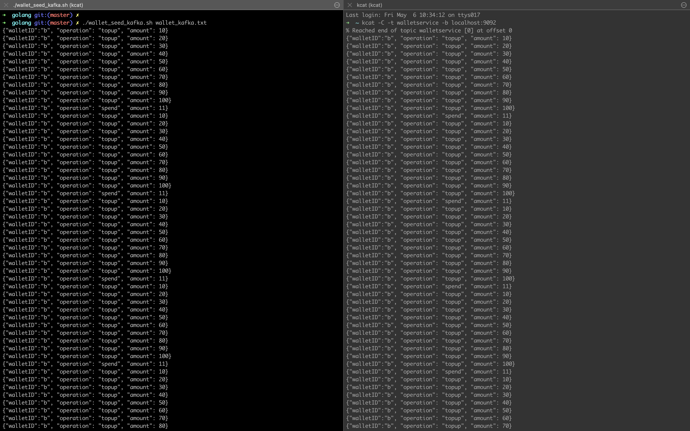
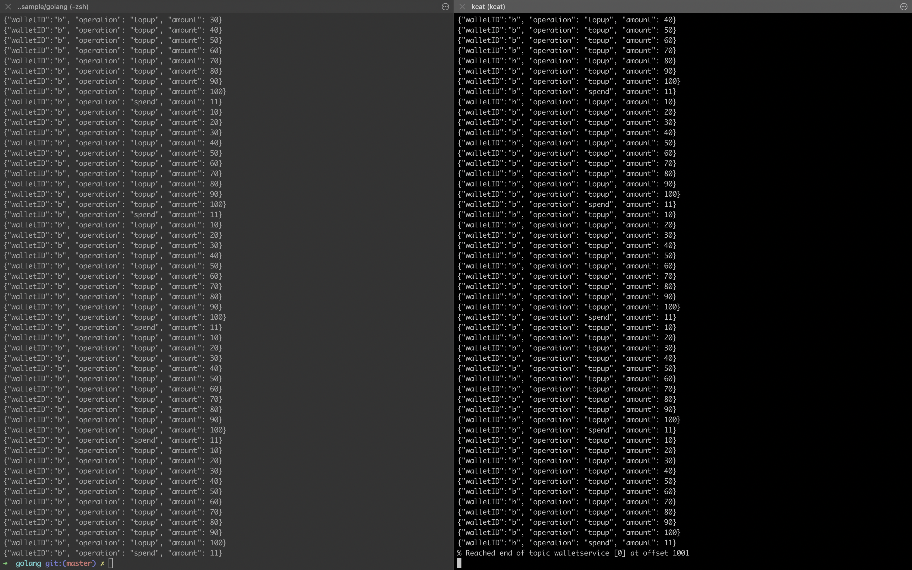
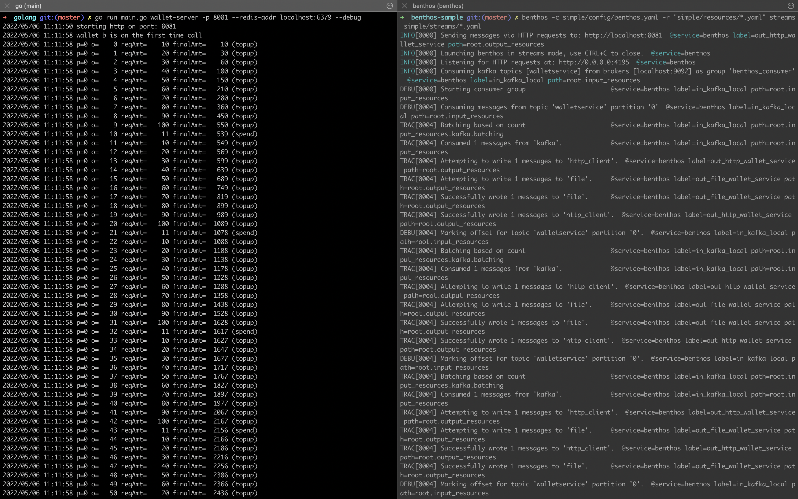
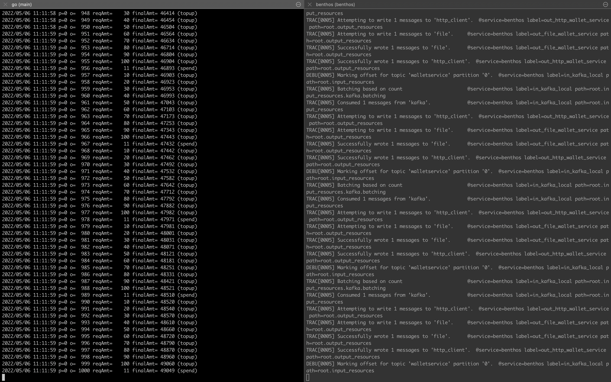
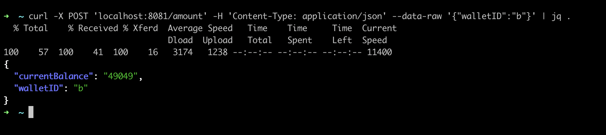
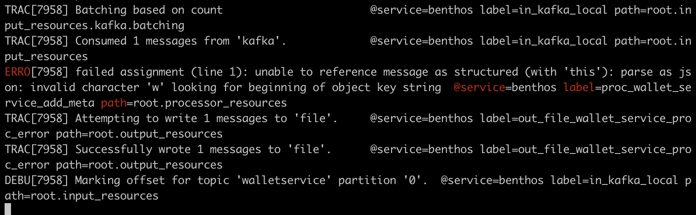
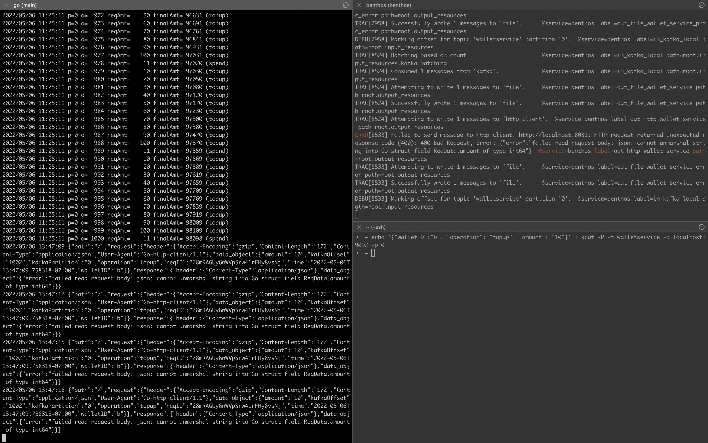

# Benthos Sample

## How to reproduce simple Benthos

### Run Prerequisites Service

We need to have Kafka and Redis in localhost.

* Kafka on port 9092 can be deployed in local using docker-compose file in this repo.
* Redis on port 6379, please use local redis server because it faster and more stable than using docker redis for distributed lock.

Running with docker compose:


> Please note some image use platform `linux/arm64` because I use M1 processor, change to `linux/amd64` if you're using Intel processor.

```shell
MY_IP=$(ipconfig getifaddr en0) docker-compose up
```

### Running golang wallet service

```shell
go run main.go wallet-server -p 8081 --redis-addr localhost:6379 --debug
```

### Trying using cURL

Try to spend money in wallet ID `a`, it must return error because we have no money to spend:

```shell
curl -L -X POST 'localhost:8081' -H 'Content-Type: application/json' --data-raw '{
    "kafkaPartition": "1",
    "kafkaOffset": "1",
    "walletID": "a",
    "operation": "spend",
    "amount": 100
}'
```

Will return error:

```json
{
    "error": "your balance is 0 and you will spend 100"
}
```

Try top-up and then spend:

```shell
curl -L -X POST 'localhost:8081' -H 'Content-Type: application/json' --data-raw '{
    "kafkaPartition": "1",
    "kafkaOffset": "1",
    "walletID": "a",
    "operation": "topup",
    "amount": 100
}'
```

response:

```json
{
    "currentBalance": "100",
    "walletID": "a"
}
```

spend:

```shell
curl -L -X POST 'localhost:8081' -H 'Content-Type: application/json' --data-raw '{
    "kafkaPartition": "1",
    "kafkaOffset": "1",
    "walletID": "a",
    "operation": "spend",
    "amount": 100
}'
```

```json
{
    "currentBalance": "0",
    "walletID": "a"
}
```

### Seed data to Kafka

```shell
$ cd golang
$ sudo chmod -R 757 wallet_seed_kafka.sh
$ ./wallet_seed_kafka.sh wallet_kafka.txt 
```

Will show:






In the script `wallet_seed_kafka.sh` I create publish message to specific partition 0. 
This because if we use multiple partition in Kafka, we will get out-of-order message in the consumer.


Imagine we push data:

```shell
DATA 1 => GOES TO PARTITION 0
DATA 2 => GOES TO PARTITION 1
DATA 3 => GOES TO PARTITION 2
DATA 4 => GOES TO PARTITION 3
DATA 5 => GOES TO PARTITION 0
DATA 6 => GOES TO PARTITION 1
DATA 7 => GOES TO PARTITION 2
DATA 8 => GOES TO PARTITION 3
```

or represented like this:

```shell
Partition 0 => [1, 5]
Partition 1 => [2, 6]
Partition 2 => [3, 7]
Partition 3 => [4, 8]
```

When consumer using the `consumer-group` name subscribe this message, the message arrived may be out of order.
The consumer may receive data with this order: [1, 3, 2, 4, 8, 7, 6, 5] because Kafka only maintain ordering for the same partition.
To avoid this behavior, the data will publish specific to partition 0 in the Kafka (Kafka topic start from 0 index).

### Consume with Benthos

Now we have Wallet service running in port 8081 and using Redis in port 6379. We will consume message from Benthos and for every consumed message,
Benthos will call to http://localhost:8081 with payload:

```json
{
    "kafkaPartition": "1",
    "kafkaOffset": "1",
    "walletID": "a",
    "operation": "topup",
    "amount": 100
}
```

Since when published to Kafka, we only send the `walletID`, `operation` and `amount` key, 
we need to add `kafkaPartition` and `kafkaOffset` in the message payload before sending to Wallet Service. 
To do this, we need to create processor which will be called after message consumed and before message send to Wallet Service:

```yaml
- label: proc_wallet_service_add_meta
    # will add kafkaPartition and kafkaOffset on the message key
    # i.e: original json message is {"walletID": "a"}
    # will become: {"kafkaPartition": "1", "kafkaOffset": "1", "walletID": "a"}
    bloblang: |-
      root = this
      root.reqID = ksuid()
      root.time = now()
      root.kafkaPartition = meta("kafka_partition")
      root.kafkaOffset = meta("kafka_offset")
```

In the real-world, there is chances that the published message is non-valid JSON string, where the Wallet Service require valid JSON string in the body request.
To know what the caused error, we create the processor of the errored payload before sending to DLQ.

```yaml
  - label: proc_catch_error
    # will convert the data from kafka to:
    # {"content": "real message from kafka", "meta": {"kafka_topic": "walletservice"}, "error": "string error", "reqID": "uuid", "time": ""}
    # this processor is useful when we receive non-valid JSON string payload from Kafka
    bloblang: |-
      let ctn = content().string()
      root.content = $ctn
      root.meta = meta()
      root.error = error()
      root.reqID = ksuid()
      root.time = now()
```

Lastly, we will create the Benthos streams definition as follows:

```yaml
# doing pipeline
input:
  resource: in_kafka_local

output:
  # Processors applied to message sent to all brokered outputs.
  # https://www.benthos.dev/docs/components/processors/try
  processors:
    - resource: proc_wallet_service_add_meta

  switch:
    cases:
      - check: errored()
        output:
          resource: out_file_wallet_service_proc_error
          processors:
            - resource: proc_catch_error

      - check: meta("kafka_topic") == "walletservice"
        output:
          broker:
            pattern: fan_out
            outputs:
              - resource: out_file_wallet_service
              - fallback:
                  - resource: out_http_wallet_service
                  - resource: out_file_wallet_service_error # DLQ if HTTP service is failed after retry

```

The above process will:

1. Consume message from Kafka and then trying to add Kafka metadata using processor `proc_wallet_service_add_meta`.
2. If processor `proc_wallet_service_add_meta` is failed, for example due to non-valid JSON, then try to catch the error using `errored` check in the switch-case and processor `out_file_wallet_service_proc_error`.
3. If processor `proc_wallet_service_add_meta` success then:
   1. Send all the message to the file (for Journaling log) using `out_file_wallet_service` and to the Wallet Service http://localhost:8081 using resource `out_http_wallet_service`.
      Writing to Journal Log file (`out_file_wallet_service`) must not return any error (in production we may send it into standard output and then pipe to another service such as Elasticsearch or database to minimize error).
      Sending to HTTP is prone to error, so we need to create `fallback` mechanism.
   2. If sending to HTTP service is failed after 3 consecutive retry, then send to DLQ `out_file_wallet_service_error`.


Run using this command:

```shell
$ benthos -c simple/config/benthos.yaml -r "simple/resources/*.yaml" streams simple/streams/*.yaml
```

Will show:



The processed message must be in the order.

```shell

```



You see that the final amount on wallet `b` is 49049.
The wallet dataset contain 1001 line of data, every 10 first data is top-up with amount: 10, 20, 30, 40, 50, 60, 70, 80, 90, 100
Then after that it will "spend" with amount of 11.
This mean that we have 91 repeated pattern (1001/11=91). 
Also mean that the top-up amount is: `(10 + 20 + 30 + 40 + 50 + 60 + 70 + 80 + 90 + 100) * 91 = 50050`.
And spending amount is: `(11 * 91) = 1001`.
The final value is `(50050 - 1001) = 49049`. This 49049 amount must be the final value we get from the API.


To double-check, see from cURL:

```shell
curl -X POST 'localhost:8081/amount' -H 'Content-Type: application/json' --data-raw '{"walletID":"b"}' | jq .
```



### Testing the errored data to DLQ

Now we only have 1 file with name `service_wallet_out.txt` because we don't have any error both in Wallet Service or in the message processor.

We can validate that all data/message consumed by Benthos from Kafka are passed to the Wallet Service.
To verify we have the right order, use `jq` and `bash` script:

```shell
$ sudo chmod -R 757 golang/check_sorted.sh
$ ./golang/check_sorted.sh service_wallet_out.txt
```

It must not return anything, if error it will show message something like this:

```shell
kafkaOffset: prev offset  999  larger than current offset  100
```

#### Produce non-valid data

Now we try to produce data that is not valid JSON string. Following data is missing `"` after `{` in key `walletID`:

```shell
echo '{walletID":"b", "operation": "topup", "amount": "10"}' | kcat -P -t walletservice -b localhost:9092 -p 0
```

We now will have new file `service_wallet_proc_error.txt` with content like this:

```json
{"content":"{walletID\":\"b\", \"operation\": \"topup\", \"amount\": \"10\"}","error":"failed assignment (line 1): unable to reference message as structured (with 'this'): parse as json: invalid character 'w' looking for beginning of object key string","meta":{"kafka_lag":"0","kafka_offset":"1001","kafka_partition":"0","kafka_timestamp_unix":"1651819063","kafka_topic":"walletservice"},"reqID":"28mQ1MGrZ7AWzGwil2BC7VJKIam","time":"2022-05-06T13:37:44.298612+07:00"}
```




The file `service_wallet_proc_error.txt` act as DLQ when processor is error. In this case, the processor is error when adding Kafka metadata because it is not valid JSON string:

```
failed assignment (line 1): unable to reference message as structured (with 'this'): parse as json: invalid character 'w' looking for beginning of object key string
```

The data will never be passed to Wallet Service because it stops when processor error.


#### Produce valid JSON data but cannot processed by Wallet Service

Now, we try to produce data that cannot be processed by Wallet Service.

```shell
echo '{"walletID":"b", "operation": "topup", "amount": "10"}' | kcat -P -t walletservice -b localhost:9092 -p 0
```

The payload may look valid, but actually is not. It because the Wallet Service expect amount to be number, but we send as string.

Now, see the Wallet Service's logs. It shows that first call is error, then Benthos will retry every 3 seconds up-to 3 times.
We can validate this by looking at the `reqID` value which still the same for all 4 requests. 



```json
2022/05/06 13:47:09 {"path":"/","request":{"header":{"Accept-Encoding":"gzip","Content-Length":"172","Content-Type":"application/json","User-Agent":"Go-http-client/1.1"},"data_object":{"amount":"10","kafkaOffset":"1002","kafkaPartition":"0","operation":"topup","reqID":"28mRAGUy6nWVpSrw41rFHy8vsNj","time":"2022-05-06T13:47:09.758318+07:00","walletID":"b"}},"response":{"header":{"Content-Type":"application/json"},"data_object":{"error":"failed read request body: json: cannot unmarshal string into Go struct field ReqData.amount of type int64"}}}
2022/05/06 13:47:12 {"path":"/","request":{"header":{"Accept-Encoding":"gzip","Content-Length":"172","Content-Type":"application/json","User-Agent":"Go-http-client/1.1"},"data_object":{"amount":"10","kafkaOffset":"1002","kafkaPartition":"0","operation":"topup","reqID":"28mRAGUy6nWVpSrw41rFHy8vsNj","time":"2022-05-06T13:47:09.758318+07:00","walletID":"b"}},"response":{"header":{"Content-Type":"application/json"},"data_object":{"error":"failed read request body: json: cannot unmarshal string into Go struct field ReqData.amount of type int64"}}}
2022/05/06 13:47:15 {"path":"/","request":{"header":{"Accept-Encoding":"gzip","Content-Length":"172","Content-Type":"application/json","User-Agent":"Go-http-client/1.1"},"data_object":{"amount":"10","kafkaOffset":"1002","kafkaPartition":"0","operation":"topup","reqID":"28mRAGUy6nWVpSrw41rFHy8vsNj","time":"2022-05-06T13:47:09.758318+07:00","walletID":"b"}},"response":{"header":{"Content-Type":"application/json"},"data_object":{"error":"failed read request body: json: cannot unmarshal string into Go struct field ReqData.amount of type int64"}}}
2022/05/06 13:47:18 {"path":"/","request":{"header":{"Accept-Encoding":"gzip","Content-Length":"172","Content-Type":"application/json","User-Agent":"Go-http-client/1.1"},"data_object":{"amount":"10","kafkaOffset":"1002","kafkaPartition":"0","operation":"topup","reqID":"28mRAGUy6nWVpSrw41rFHy8vsNj","time":"2022-05-06T13:47:09.758318+07:00","walletID":"b"}},"response":{"header":{"Content-Type":"application/json"},"data_object":{"error":"failed read request body: json: cannot unmarshal string into Go struct field ReqData.amount of type int64"}}}
```

See the `time` value which incremented by 3 seconds, meaning that the next request will be made after 3 seconds if previous call is failed.

After 4 failed requests (1 for first request and 3 for retry), Benthos will save the failed request into file `service_wallet_error.txt`.
The content of file `service_wallet_error.txt` will look like this:

```json
{"amount":"10","kafkaOffset":"1002","kafkaPartition":"0","operation":"topup","reqID":"28mRAGUy6nWVpSrw41rFHy8vsNj","time":"2022-05-06T13:47:09.758318+07:00","walletID":"b"}
```

Benthos will also save to file `service_wallet_out.txt` regardless all retries already done or not, this is used for journal log.
The content of file `service_wallet_out.txt` will be appended with new data:

```json
{"amount":"10","kafkaOffset":"1002","kafkaPartition":"0","operation":"topup","reqID":"28mRAGUy6nWVpSrw41rFHy8vsNj","time":"2022-05-06T13:47:09.758318+07:00","walletID":"b"}
```

The `kafkaOffset` is 1002 because the offset 1001 is used by previous data when we try to publish non-valid JSON string.


## Generate Key store kafka

```shell
$ mkdir -p config/kafka/cert
$ keytool -keystore config/kafka/cert/kafka.server.keystore.jks -alias localhost -validity 365 -genkey
$ keytool -importkeystore -srckeystore config/kafka/cert/kafka.server.keystore.jks -destkeystore config/kafka/cert/kafka.server.keystore.jks -deststoretype pkcs12
$ openssl req -new -x509 -keyout config/kafka/cert/ca-key -out config/kafka/cert/ca-cert -days 365
$ keytool -keystore config/kafka/cert/kafka.server.truststore.jks -alias CARoot -import -file config/kafka/cert/ca-cert
```

Sign cert

```shell
$ keytool -keystore config/kafka/cert/kafka.server.keystore.jks -alias localhost -certreq -file config/kafka/cert/cert-file
$ openssl x509 -req -CA config/kafka/cert/ca-cert -CAkey config/kafka/cert/ca-key -in config/kafka/cert/cert-file -out config/kafka/cert/cert-signed -days 365 -CAcreateserial -passin pass:mypassword
$ keytool -keystore config/kafka/cert/kafka.server.keystore.jks -alias CARoot -import -file config/kafka/cert/ca-cert
$ keytool -keystore config/kafka/cert/kafka.server.keystore.jks -alias localhost -import -file config/kafka/cert/cert-signed
```