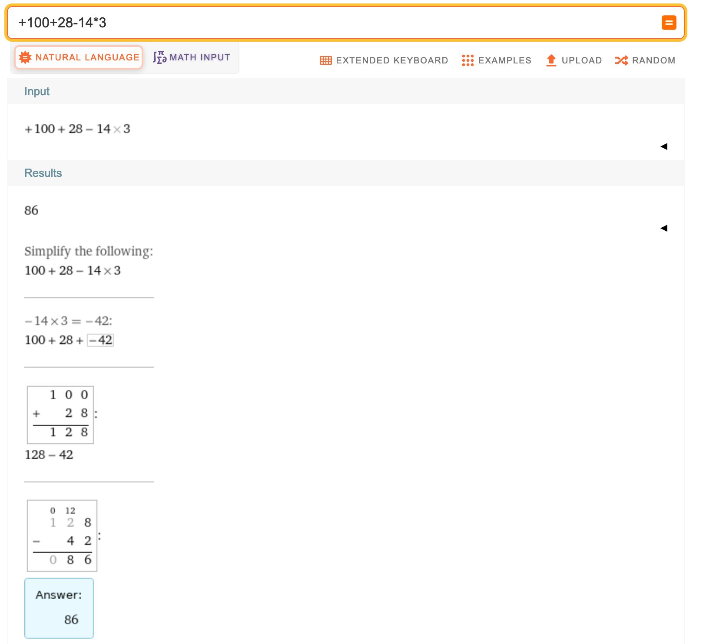
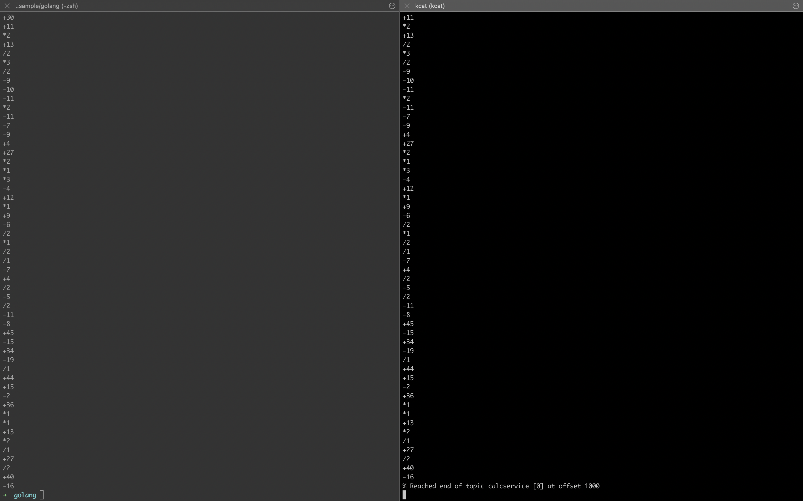

# Benthos Sample

**Please note**: this advance reading material may still in progress, some step maybe still undocumented. 
Please take on your own risk if you try this in production.


## How to reproduce routing message using Benthos

### Have Redis and Kafka ready
First, run Redis and Kafka with simple docker installation: 

```shell
MY_IP=$(ipconfig getifaddr en0) docker compose -f docker-compose.yaml up
```

It will run Redis on port 6379 and Kafka on port 9092, and also create 4 Kafka topic:

- `simple` -> for simple Benthos
- `calcservice` -> for calculate service
- `walletservice` -> for wallet service
- `emailservice` -> for email service


### Ensure .sh script executable:

Go to `golang` directory and run:

```shell
sudo chmod -R 757 number_seed_kafka.sh number_test_curl.sh wallet_seed_kafka.sh wallet_test_curl.sh
```

### Know the use-case

In this project, I create 3 use case with each data set to try, I think it will represent real-world use case in business.

#### First, Calculation Service
Actually I don't have any idea whether this service real-world use case or not, 
but this is what I think about proof of concept mimicking data ordering. Because in mathematica, when we do operation sequentially
it will return different result. For example, when we do 3 * 3 and then the result of 3 * 3 (which is 9) is plus with 3, it will return 12.
It will be much different if the operation "plus 3" arrives before "times 3", resulting 3 + 3 and the result of that (3+3 = 6) times 3 = 18.

In this case, I create `number.txt` data set and validation program to make sure data ordering come from Kafka (consumed by Benthos)
is still in their order. The data set itself contain mathematica operation in each line, for example:

```shell
+100
+28
-14
*3
```

We will do operation in sequential mode, meaning the operation of `+100+28` must done before subtract it with `-14`.
The operation order will do as follows:

1. `+100+28` = 128
2. Above result then subtracted with current value (`14`): `128-14` = 114
3. Above result then multiple with current value (`3`): `114*3` = 342

This operation result is different if we use [Real World Mathematica Order or Operation](https://en.wikipedia.org/wiki/Order_of_operations), 
if we do this it will result: `+100+28-14*3` = 86, because it will do the operation order as follows:



But, please don't debate about sequential mathematics operation is make sense or not as I just want to try sequential ordering.

To reproduce sequential mathematics operation, run this command:

```shell
go run main.go calculate-file-number number.txt
```

This will return:

```shell
# some output is omitted
2022/04/28 11:55:57 calculated value inside file are: 2179878766159874942421130944338
```

From the output we know that if we do sequential mathematics operation (operate some mathematics calculation from previous result),
we got 2179878766159874942421130944338. This value must be returned by the system if we consume this message from Kafka.


#### Second, Wallet Service

This service is oversimplification of financial wallet service where we can top up and spend money in the wallet identified by `walletID`.
Imagine that we have wallet `b` with initial zero value, we must ensure to top-up and have enough balance before spending any money.

Actually, when we think about the final value, the eventual consistency is enough for simple mathematica operation like addition and subtraction.
By this I mean, when we do 100 times top-up of 10 cents for each (no matter what the order) and then spend 1 cent 200 times (without checking the current balance),
we still got 800 from operation:

```shell
  (10 cents * 100) - (1 cent * 200 )
= (1000) - (200)
= 800
```

But, on the financial system we have this rule:

* We must check if current balance is enough before spending. If user only doing top-up once only with amount 10 cents, then
  they spend 100 cents and never top-up again, then we have money lost.
* Ordering is matter for financial journal system. It can be used for accounting, analytic, and auditing.

Again, please step aside your debate thinking if it only goes to "financial system should be A, B or C", because here I only want to show about how to manage order message.

To mimicking this "oversimplified" wallet system, I create one REST API which can be called using this curl:

```shell
curl -L -X POST 'localhost:8082/' -H 'Content-Type: application/json' --data-raw '{
    "kafkaPartition": "1",
    "kafkaOffset": "1",
    "walletID": "a",
    "operation": "spend",
    "amount": 100
}'
```

As you notice that there are `kafka*` metadata that included in request. 
This only to show in debug log that the message comes to the server is the same as message order in Kafka partition.

#### Third, Email Service

This is not actually sending email service, but only process the request body and echo it into response.
I also add some logic to add some errors if certain amount of request has been made.
The service will force returning HTTP Status xxx for 3 request ahead if it already hits by the client 5 times.

```shell
REQ  1 => SUCCESS
REQ  2 => SUCCESS
REQ  3 => SUCCESS
REQ  4 => SUCCESS
REQ  5 => SUCCESS
REQ  6 => FORCE FAIL
REQ  7 => FORCE FAIL
REQ  8 => FORCE FAIL
REQ  9 => SUCCESS
REQ 10 => SUCCESS
REQ 11 => SUCCESS
REQ 12 => SUCCESS
REQ 13 => SUCCESS
REQ 14 => FORCE FAIL
REQ 15 => FORCE FAIL
REQ 16 => FORCE FAIL
REQ 17 => SUCCESS
# ... and so on
```

### Consume and route data with Benthos

#### Seeding the data

As we're ready to have data set, let's seed that into Kafka streams.

For message to Calculation Service we use topic `calservice` and route the message only to partition 1.
This because if we spread the data into more than one partition, the consumer will get data from each partition in parallel.
Parallel consumers makes the data out of order. It is true that each partition have ordering consistency, but when merging 2 or more partition,
the ordering is not like when we do publish them.

Imagine we push data:

```shell
DATA 1 => GOES TO PARTITION 1
DATA 2 => GOES TO PARTITION 2
DATA 3 => GOES TO PARTITION 3
DATA 4 => GOES TO PARTITION 4
DATA 5 => GOES TO PARTITION 1
DATA 6 => GOES TO PARTITION 2
DATA 7 => GOES TO PARTITION 3
DATA 8 => GOES TO PARTITION 4
```

or represented like this:

```shell
Partition 1 => [1, 5]
Partition 2 => [2, 6]
Partition 3 => [3, 7]
Partition 4 => [4, 8]
```

When consumer using the `consumer-group` name subscribe this message, the message arrived may be out of order.
The consumer may receive data with this order: [1, 3, 2, 4, 8, 7, 6, 5] because Kafka only maintain ordering for the same partition.

To seed data into `calcservice topic`, run

```shell
./number_seed_kafka.sh number.txt
```

Then verify with:

```shell
kcat -C -t calcservice -b localhost:9092
```



You will get the message `% Reached end of topic calcservice [0] at offset 1000` at the end of command.


Now, we do the same for Wallet Service data set, run:

```shell
./wallet_seed_kafka.sh wallet_kafka.txt
```

We use `wallet_kafka.txt` because this data is not contain Kafka metadata. We will add Kafka metadata using Benthos pipeline later.

and to validate:

```shell
cat -C -t walletservice -b localhost:9092
```


You will get the message `% Reached end of topic calcservice [0] at offset 1001` at the end of command.

> The wallet dataset contain 1001 line of data, every 10 first data is top-up with amount: 10, 20, 30, 40, 50, 60, 70, 80, 90, 100
> Then after that it will "spend" with amount of 11.
> This mean that we have 91 repeated pattern (1001/11=91).
> 
> Also mean that the top-up amount is: `(10 + 20 + 30 + 40 + 50 + 60 + 70 + 80 + 90 + 100) * 91 = 50050`.
> And spending amount is: `(11 * 91) = 1001`.
> The final value is `(50050 - 1001) = 49049`. This 49049 amount must be the final value we get from the API. 


#### Working with Benthos

We need to **route** the message based on Kafka topic, the rule is:

* Topic `calcservice` must be routed to Calculation Service.
  * We also need to convert message from Kafka into valid JSON message to be sent to Calculation Service via REST API.
  * We use fan-out mechanism, first send it into file and also send to Calculation Service via HTTP in concurrent. 
    We write the content into file as is we're receiving from Kafka. This way we can compare the message ordering.
* Topic `walletservice` must be routed to Wallet Service.
  * Same as Calculation Service, this message will be routed using fan-out mechanism: one into file and to HTTP.
    The differences are, we transform the message before sending to all output. This to try the Dead Letter Queue when we failed to transform the message.
    The DLQ is only file output with the file name `out_file_wallet_service_error.txt`.
* Topic `emailservice` must be router to Email Service.
  * ...

To do that, first we need to create some resources' definition of Benthos input, processor and output.
See directory `multiplex/resources/*.yaml`. 
Then, in directory `multiplex/streams` we define each service pipeline processor with convention name `service_xxx.yaml`.

After writing all Benthos configuration, we can check if it has any error by running linter:

```shell
benthos lint multiplex/**/*.yaml
```

If there's no error, we're good! Next try running all the required server. As we define in the `multiplex/resources/output.yaml`
we route all HTTP output into localhost with:

```shell
* Calculation service => http://localhost:8080
* Wallet service      => http://localhost:8081
* Email service       => http://localhost:8082
```

So, we can run the Golang server with 3 tabs of terminal:

**Calculation service**

```shell
go run main.go calculate-server -p 8080 --redis-addr localhost:6379 --mutex-key calcservice:mutex --redis-key "calcservice:operation"
```

**Wallet service**

```shell
go run main.go wallet-server -p 8081 --redis-addr localhost:6379
```

Then running Benthos with:

```shell
 benthos -c multiplex/config/benthos.yaml -r "multiplex/resources/*.yaml" streams multiplex/streams/*.yaml
```


## Available command

```shell
program calculate-server -p 8080 --redis-addr localhost:6379 --mutex-key calcservice:mutex --redis-key "calcservice:operation"
program wallet-generate --wallet-id a --kafka-meta -o wallet.txt
program wallet-server -p 8080 --redis-addr localhost:6379 
```

## Lesson Learned
I don't know if this is my configuration error or Benthos's error. When we define input in the resource (in my case is Kafka input),
and then use it multiple times (in the stream configuration) for each service, then the message routing is not work as expected.
Sometimes message from topic A is still routed to the service B even though we already define using `switch-check`.

Maybe still better to have 1 Benthos deployment for 1 ETL processing, 
specifically when we work with different topic has different transform process AND route to different service.

But, if the use-case is simple like "we have 1 Kafka cluster for all topic, each topic should be routed to different HTTP service 
AND we DON'T DO ANY PREPROCESSING USING Benthos before sending it. Also, we DON'T USE FAN-OUT."
For this use-case **I think** we **CAN** deploy 1 Benthos to be used for several stream.

But again, please consider when we use configuration that is not simple (for example, broker output or heavily use switch and try),
I still recommend deploying one Benthos for one use-case.

TODO:
* [x] Check if we define each input for each stream. RESULT: behaves normal, so we need to define each input even though the Kafka cluster has the same address.
  I don't know if we define let say 100 input of Kafka then the application will spawn 100 connection to Kafka?